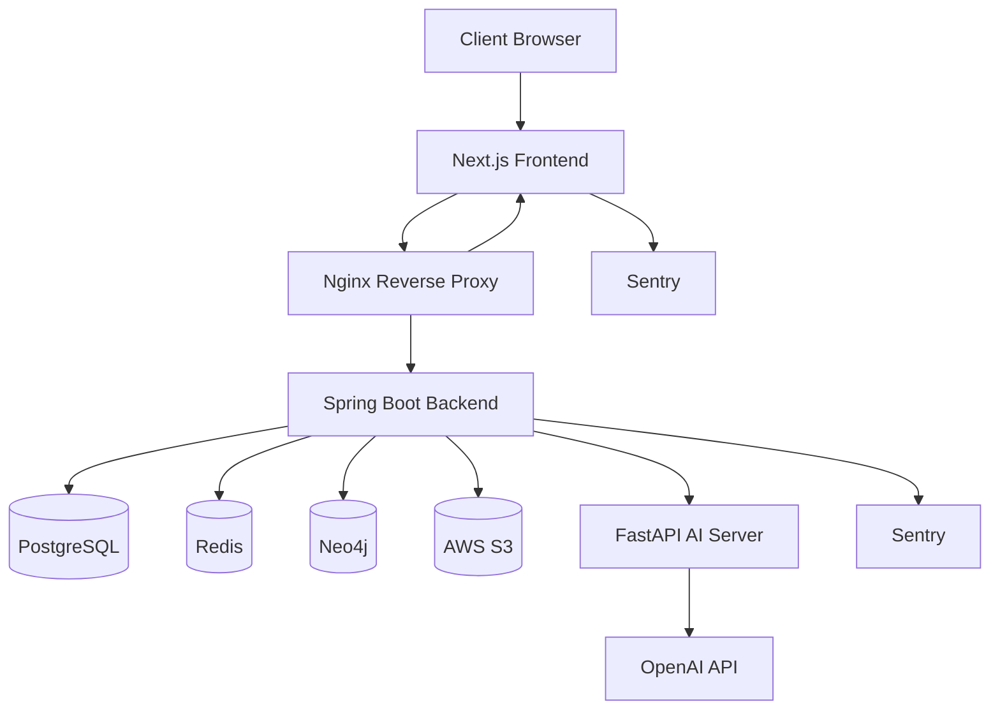

## Intro
> 노트, 그래프를 기반으로 한 AI 보조 개인 지식 관리 플랫폼

Astro는 사용자가 노트를 작성하고, 생각을 연결하며, 지식 그래프로 관계를 시각화하고, AI를 통해 사고를 확장할 수 있도록 돕는 개인 지식 관리 서비스입니다.

---

## Problem

우리는 생각보다 많은 것을 메모하고 기록합니다.  
기존 노트 도구들은 이미 정보를 저장하고 정리하는 데에는 충분히 유용합니다.  
하지만 시간이 지나면 그 기록들은 필요한 순간에 잘 떠오르지 않거나, 서로 연결되지 못한 채 흩어진 정보로 남는 경우가 많습니다.

이 과정에서 다음과 같은 아쉬움이 남았습니다.

* 노트 간 관계를 자연스럽게 발견하기 어렵다
* 기존 PKM 서비스들은 초반 설정이 부담스럽다.
* 흩어진 정보들을 확장된 인사이트로 발전시키기 어렵다

그리하여 Astro는 단순히 기록을 저장하는 데서 끝나는 것이 아니라, 기록된 생각을 서로 연결하고, 그래프로 탐색하며, AI를 통해 다시 질문하여 인사이트를 확장할 수 있는 서비스를 만들고자 했습니다.

---

## Core Features

### Notes

* 마크다운 기반 노트 에디터
* 노트 생성, 수정, 삭제, 복구, 영구 삭제
* 노트 검색 및 정렬
* 자동 저장 지원
* 노트 복제
* 마크다운 다운로드

### Wiki Links

* `[[note title]]` 형식으로 노트 간 관계 생성
* 노트 내용을 파싱해 연결된 노트 탐지
* 노트 관계를 그래프에 반영
* 수동 그래프 링크 생성 지원

### Knowledge Graph

* 노트 간 관계를 그래프 노드와 엣지로 시각화
* 최근 지식 그래프 개요 조회
* 그래프 노드 검색
* 전체 그래프 탐색
* 특정 노드 중심 탐색

### AI Assistance

* 노트 요약
* 제목 추천
* 질문 추천
* 노트 기반 Q&A

### Files

* 노트에 파일 업로드
* 이미지 파일 미리보기
* 파일 다운로드
* 파일 삭제

### Authentication

* 이메일 회원가입 및 로그인
* JWT 액세스 토큰
* OAuth 로그인
* 비밀번호 재설정
* 로그아웃 및 회원 탈퇴(SOFT DELETE)

---

## Architecture



## System Design

| Component           | Responsibility                |
| ------------------- | ----------------------------- |
| Next.js Frontend    | UI 렌더링, 라우팅, 클라이언트 측 상호작용     |
| Spring Boot Backend | 비즈니스 로직, 인증, 노트/파일/그래프 API    |
| PostgreSQL          | 사용자, 노트, 파일, 노트 블록 등 트랜잭션 데이터 |
| Neo4j               | 그래프 노드와 노트 관계                 |
| Redis               | 리프레시 토큰 저장 및 향후 캐시 계층         |
| S3                  | 파일 객체 저장                      |
| FastAPI AI Server   | AI 관련 처리 및 OpenAI API 연동      |
| Nginx               | HTTPS 종료 및 리버스 프록시            |

---

## Tech Stack

### Frontend

| Category     | Tech                                           |
| ------------ | ---------------------------------------------- |
| Framework    | Next.js                                        |
| Language     | TypeScript                                     |
| UI           | React, Tailwind CSS                            |
| Server State | TanStack Query                                 |
| Form         | React Hook Form                                |
| Markdown     | react-markdown, remark-gfm                     |
| i18n         | next-intl                                      |
| Monitoring   | Sentry                                         |
| Test         | Vitest, React Testing Library, MSW, Playwright |

### Backend

| Category          | Tech                                     |
| ----------------- | ---------------------------------------- |
| Framework         | Spring Boot                              |
| Language          | Java                                     |
| Security          | Spring Security, JWT, OAuth2             |
| ORM               | Spring Data JPA                          |
| Database          | PostgreSQL                               |
| Graph Database    | Neo4j                                    |
| Cache/Token Store | Redis                                    |
| File Storage      | AWS S3                                   |
| Migration         | Flyway                                   |
| Monitoring        | Sentry                                   |
| Test              | JUnit5, Mockito, AssertJ, Testcontainers |

### AI Server

| Category  | Tech                                   |
| --------- | -------------------------------------- |
| Framework | FastAPI                                |
| Language  | Python                                 |
| LLM       | OpenAI API                             |
| Retrieval | Lexical Retriever, Embedding Retriever |
| Test      | Pytest                                 |

### Infra

| Category      | Tech           |
| ------------- | -------------- |
| Deployment    | Docker Compose |
| Reverse Proxy | Nginx          |
| HTTPS         | Certbot        |
| CI/CD         | GitHub Actions |
| Server        | AWS EC2        |

---

## Testing Strategy

### Frontend Testing

| Type        | Tool                  | Target                   |
| ----------- | --------------------- | ------------------------ |
| Unit Test   | Vitest                | 유틸리티, mapper, validation |
| Hook Test   | React Testing Library | 커스텀 훅                    |
| API Mocking | MSW                   | API 동작                   |
| E2E Test    | Playwright            | 사용자 플로우                  |


### Backend Testing

| Type             | Tool                 | Target                   |
| ---------------- | -------------------- | ------------------------ |
| Unit Test        | JUnit5, Mockito      | 도메인/서비스 로직               |
| Integration Test | Spring Boot Test     | 실제 흐름 검증                 |
| DB Test          | Testcontainers       | PostgreSQL, Redis, Neo4j |
| Security Test    | Spring Security Test | 인증된 흐름                   |

### AI Testing

| Type           | Tool   | Target           |
| -------------- | ------ | ---------------- |
| Unit Test      | Pytest | AI 서비스 로직        |
| Format Test    | Pytest | 답변 정규화           |
| Retrieval Test | Pytest | Q&A retrieval 동작 |

---

## Monitoring


### Frontend Monitoring

프론트엔드 모니터링은 다음 정보를 수집합니다.

* 클라이언트 측 런타임 에러
* API 요청 실패
* React Query 에러
* 사용자 상호작용 breadcrumb
* sanitizing 처리된 메타데이터

### Backend Monitoring

백엔드 모니터링은 다음 정보를 수집합니다.

* 5xx 서버 에러
* 외부 연동 실패
* AI 서버 장애
* 요청 trace 정보
* sanitizing 처리된 에러 컨텍스트

토큰, 비밀번호, 쿠키, 노트 내용, 파일명과 같은 민감 값은 로그나 Sentry로 전송되기 전에 마스킹됩니다.

---

## Deployment

### Deployment Flow

```txt
Push to production branch
  ↓
GitHub Actions
  ↓
SSH into EC2
  ↓
Pull latest source
  ↓
Build Docker images
  ↓
Restart services with Docker Compose
```

## Demo 

### 1. Write a Note

사용자가 노트를 작성합니다.

```txt
Today I learned about graph-based knowledge management.
I want to connect this with [[Knowledge Graph]] and [[AI Q&A]].
```

추천 스크린샷/GIF:

```txt
docs/images/demo-01-note-write.gif
```

---

### 2. Create a Wiki Link

사용자가 노트 에디터 안에 `[[note title]]`을 입력합니다.

```txt
[[Knowledge Graph]]
```

Astro는 노트 내용을 파싱하고 노트 간 관계를 탐지합니다.

추천 스크린샷/GIF:

```txt
docs/images/demo-02-wiki-link.gif
```

---

### 3. Reflect Link in Graph

연결된 노트들이 그래프 노드로 표시되고 서로 연결됩니다.

추천 스크린샷/GIF:

```txt
docs/images/demo-03-graph-reflect.gif
```

---

### 4. Recommend AI Questions

Astro는 노트 내용을 기반으로 후속 질문을 추천합니다.

예시:

```txt
- How does a knowledge graph improve personal note-taking?
- What is the difference between tags and graph relationships?
- How can AI help discover hidden connections between notes?
```

추천 스크린샷/GIF:

```txt
docs/images/demo-04-ai-question-recommend.gif
```

---

### 5. Ask AI Q&A

사용자가 자신의 노트를 기반으로 질문합니다.

```txt
How are my notes about knowledge graphs connected to AI Q&A?
```

Astro는 관련 노트 문맥을 검색하고, 출처와 함께 답변을 생성합니다.

추천 스크린샷/GIF:

```txt
docs/images/demo-05-ai-qa.gif
```

---

### 6. Upload a File

사용자가 노트에 파일을 업로드하고, 이후 미리보기 또는 다운로드할 수 있습니다.

추천 스크린샷/GIF:

```txt
docs/images/demo-06-file-upload.gif
```

---


