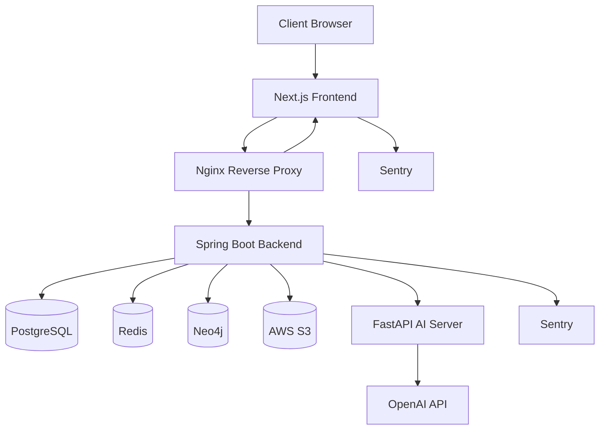
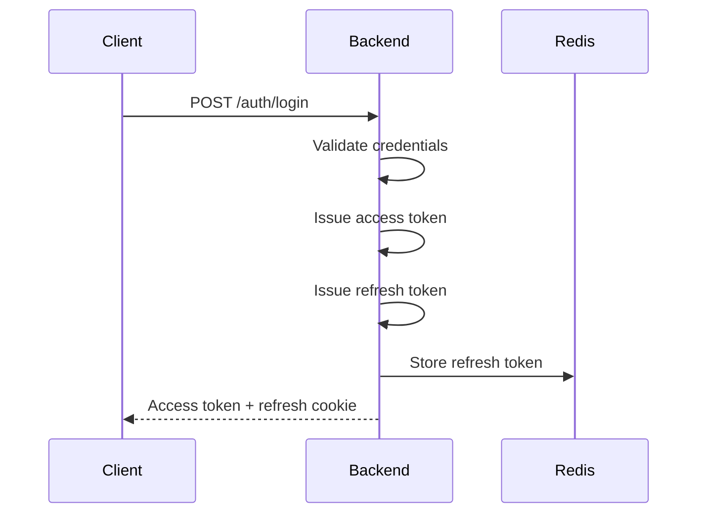
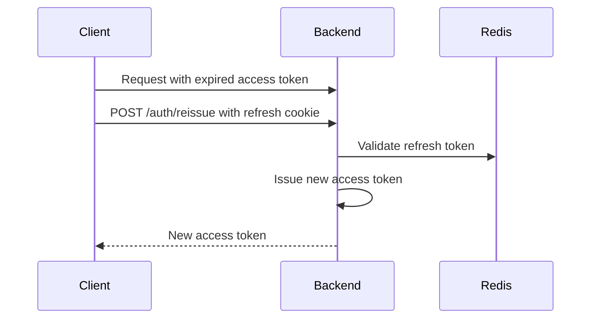

# Astro

> AI-assisted personal knowledge management platform based on Markdown notes, knowledge graph, and semantic Q&A.

Astro is a full-stack personal knowledge management service that helps users write notes, connect ideas with wiki-style links, visualize relationships as a knowledge graph, and expand their thinking with AI-powered recommendations and Q&A.

---

## Problem

People often write notes, but their ideas remain isolated.

Traditional note-taking tools are good at storing information, but they often fail to help users:

* discover relationships between notes
* revisit old ideas in context
* understand how their knowledge grows over time
* ask questions based on their own notes
* turn scattered thoughts into connected knowledge

Astro was built to solve this problem by combining note-taking, graph-based exploration, and AI assistance.

---

## Solution

Astro transforms personal notes into a connected knowledge graph.

Users can write Markdown notes, create wiki-style links using `[[note title]]`, upload files, and explore their knowledge visually through a graph. AI features help users summarize notes, recommend titles, generate follow-up questions, and answer questions based on their own note content.

Astro is designed as a real-world full-stack service, not just a CRUD application.

It includes:

* Next.js frontend
* Spring Boot backend
* FastAPI AI server
* PostgreSQL for transactional data
* Neo4j for graph relationships
* Redis for token/session-related data
* S3 for file storage
* Docker Compose deployment
* Nginx reverse proxy
* Sentry monitoring
* CI/CD with GitHub Actions

---

## Core Features

### Notes

* Create, update, delete, restore, and permanently delete notes
* Markdown-based note editor
* Auto-save support
* Note duplication
* Trash management
* Markdown export
* Recent note list
* Search and sort notes

### Wiki Links

* Create note relationships using `[[note title]]`
* Parse note content and detect linked notes
* Reflect note relationships in the graph
* Support manual graph link creation

### Knowledge Graph

* Visualize note relationships as graph nodes and edges
* View recent knowledge graph overview
* Search graph nodes
* Explore full graph
* Focus on specific notes
* Limit graph traversal depth and node count to protect performance

### AI Assistance

* Note summary
* Title recommendation
* Question recommendation
* Tag recommendation
* Note-based Q&A
* AI answer formatting normalization
* Fallback handling for malformed AI responses

### Files

* Upload files to notes
* Preview image files
* Download files
* Delete files
* Validate file ownership and access permission
* Store files in S3 instead of application server disk

### Authentication

* Email signup and login
* JWT access token
* Refresh token stored with Redis
* HttpOnly/Secure cookie-based refresh flow
* OAuth login
* Password reset
* Email/phone verification
* Logout and account withdrawal

### Operations

* Docker-based deployment
* Nginx HTTPS reverse proxy
* GitHub Actions CI/CD
* Sentry error monitoring
* Request logging with trace information
* Environment-based production configuration

---

## Architecture

### System Overview

```txt
Client
  ↓
Next.js Frontend
  ↓ /api
Nginx
  ↓
Spring Boot Backend
  ├── PostgreSQL
  ├── Redis
  ├── Neo4j
  ├── S3
  └── FastAPI AI Server
        ↓
      OpenAI API
```

### Architecture Diagram



---

## Tech Stack

### Frontend

| Category     | Tech                                           |
| ------------ | ---------------------------------------------- |
| Framework    | Next.js                                        |
| Language     | TypeScript                                     |
| UI           | React, Tailwind CSS                            |
| Server State | TanStack Query                                 |
| Form         | React Hook Form                                |
| Markdown     | react-markdown, remark-gfm                     |
| i18n         | next-intl                                      |
| Monitoring   | Sentry                                         |
| Test         | Vitest, React Testing Library, MSW, Playwright |

### Backend

| Category          | Tech                                     |
| ----------------- | ---------------------------------------- |
| Framework         | Spring Boot                              |
| Language          | Java                                     |
| Security          | Spring Security, JWT, OAuth2             |
| ORM               | Spring Data JPA                          |
| Database          | PostgreSQL                               |
| Graph Database    | Neo4j                                    |
| Cache/Token Store | Redis                                    |
| File Storage      | AWS S3                                   |
| Migration         | Flyway                                   |
| Monitoring        | Sentry                                   |
| Test              | JUnit5, Mockito, AssertJ, Testcontainers |

### AI Server

| Category  | Tech                                   |
| --------- | -------------------------------------- |
| Framework | FastAPI                                |
| Language  | Python                                 |
| LLM       | OpenAI API                             |
| Retrieval | Lexical Retriever, Embedding Retriever |
| Test      | Pytest                                 |

### Infra

| Category      | Tech           |
| ------------- | -------------- |
| Deployment    | Docker Compose |
| Reverse Proxy | Nginx          |
| HTTPS         | Certbot        |
| CI/CD         | GitHub Actions |
| Server        | AWS EC2        |

---

## System Design

Astro separates responsibilities by workload type.

### Responsibility Separation

| Component           | Responsibility                                              |
| ------------------- | ----------------------------------------------------------- |
| Next.js Frontend    | UI rendering, routing, client-side interaction              |
| Spring Boot Backend | Business logic, authentication, note/file/graph APIs        |
| PostgreSQL          | Transactional data such as users, notes, files, note blocks |
| Neo4j               | Graph nodes and note relationships                          |
| Redis               | Refresh token storage and future cache layer                |
| S3                  | File object storage                                         |
| FastAPI AI Server   | AI-related processing and OpenAI API integration            |
| Nginx               | HTTPS termination and reverse proxy                         |

### Load-Aware Design

Astro identifies several load-sensitive areas:

| Area             | Risk                           | Current/Planned Strategy                                      |
| ---------------- | ------------------------------ | ------------------------------------------------------------- |
| Note list/detail | Frequent read requests         | Pagination, indexes, React Query cache                        |
| Auto-save        | Repeated write requests        | Debounce, dirty check, duplicate save prevention              |
| Graph API        | Expensive traversal            | depth, seed size, node count limits                           |
| AI API           | Slow and costly external calls | Separate AI server, timeout, rate limit, content length limit |
| File upload      | Disk/network overhead          | S3 storage, file size/type validation                         |
| Authentication   | Abuse-prone endpoints          | Redis token store, planned rate limit                         |

### Scaling Plan

Astro currently targets an early-stage service scale: around 1,000 registered users and tens of concurrent active users.

If traffic grows, Astro can scale in this order:

1. Move PostgreSQL, Redis, and Neo4j out of the application server.
2. Add Redis caching for graph overview and repeated AI results.
3. Horizontally scale stateless Spring Boot backend instances.
4. Move long-running AI requests to an asynchronous job queue.
5. Serve uploaded files through S3/CDN.
6. Add stricter API rate limits and request quotas.

---

## Database Design

Astro uses PostgreSQL and Neo4j together.

PostgreSQL stores transactional data, while Neo4j stores note relationships for graph traversal.

### PostgreSQL

Main tables:

| Table       | Description                          |
| ----------- | ------------------------------------ |
| users       | User account and authentication data |
| notes       | Note metadata                        |
| note_blocks | Text/file blocks inside a note       |
| files       | Uploaded file metadata               |
| tags        | Tag data                             |
| note_tags   | Note-tag mapping                     |

### PostgreSQL Index Strategy

| Index Target                     | Purpose                                    |
| -------------------------------- | ------------------------------------------ |
| notes(user_id, updated_at)       | Optimize note list sorted by recent update |
| notes(user_id, status)           | Optimize active/trash note filtering       |
| note_blocks(note_id, sort_order) | Optimize note detail block ordering        |
| files(note_id)                   | Optimize file lookup by note               |
| files(user_id)                   | Optimize ownership validation              |
| note_tags(note_id, tag_id)       | Prevent duplicate tag mapping              |

### Neo4j

Neo4j stores note nodes and note-to-note relationships.

Main graph model:

```txt
(:Note {noteId, userId, title, status})
  -[:LINKS_TO {kind, createdAt}]->
(:Note {noteId, userId, title, status})
```

Neo4j is used for:

* graph overview
* full graph exploration
* note relationship traversal
* graph search
* focused graph view

### Neo4j Constraint/Index Strategy

| Target                        | Purpose                            |
| ----------------------------- | ---------------------------------- |
| Note.noteId unique constraint | Prevent duplicated note nodes      |
| Note.userId index             | Optimize per-user graph traversal  |
| Note(userId, status) index    | Optimize active-note graph queries |
| Relationship properties       | Support link metadata              |

---

## AI Pipeline

Astro provides AI features through a separate FastAPI server.

### AI Request Flow

```txt
Client
  ↓
Next.js Frontend
  ↓
Spring Boot Backend
  ↓
FastAPI AI Server
  ↓
OpenAI API
```

### AI Features

| Feature                 | Description                            |
| ----------------------- | -------------------------------------- |
| Summary                 | Summarize note content                 |
| Title Recommendation    | Recommend note titles from content     |
| Question Recommendation | Generate follow-up questions           |
| Tag Recommendation      | Recommend tags                         |
| Q&A                     | Answer questions based on user's notes |

### Q&A Pipeline

```txt
User Question
  ↓
Keyword Extraction
  ↓
Lexical Retrieval
  ↓
Optional Embedding Retrieval
  ↓
Top-K Context Selection
  ↓
LLM Answer Generation
  ↓
Answer Format Normalization
  ↓
Response with Sources
```

### AI Reliability Strategy

Astro handles unstable LLM output by:

* requesting structured JSON responses
* normalizing malformed answers
* removing unsupported Markdown tables
* stripping unsafe HTML
* limiting answer length
* applying fallback responses when context is insufficient
* separating AI server failure from core backend failure

### AI Load Strategy

AI APIs are treated differently from normal CRUD APIs because they are slower and more expensive.

Current/planned protections:

* separate FastAPI server
* backend-to-AI timeout
* OpenAI API timeout handling
* per-user rate limit
* input length limit
* note content hash-based result caching
* future async job queue for long-running AI requests

---

## Authentication Flow

Astro uses access tokens and refresh tokens.

### Login Flow



### Token Reissue Flow



### Logout Flow

```txt
Client
  ↓
POST /auth/logout
  ↓
Backend deletes refresh token from Redis
  ↓
Client clears access token
```

### Security Decisions

| Decision                             | Reason                                                |
| ------------------------------------ | ----------------------------------------------------- |
| Access token in Authorization header | Avoid unnecessary cookie-based auth for every request |
| Refresh token in HttpOnly cookie     | Reduce XSS exposure                                   |
| Refresh token stored in Redis        | Enable logout and token invalidation                  |
| Sentry sanitization                  | Prevent sensitive data leakage in logs                |
| Production Swagger disabled          | Reduce public attack surface                          |
| File ownership validation            | Prevent unauthorized file access                      |

---

## Graph Sync Strategy

Astro uses PostgreSQL as the source of truth for notes and Neo4j as the graph read model.

### Current Strategy

When notes or links are created/updated, the backend updates graph data in Neo4j.

Graph data is used for:

* graph overview
* full graph
* graph search
* focused graph traversal
* manual link creation

### Wiki Link Sync

```txt
Note Content
  ↓
Parse [[note title]]
  ↓
Find matching notes
  ↓
Create or update LINKS_TO relationship
  ↓
Return graph response
```

### Consistency Risk

Because Astro uses both PostgreSQL and Neo4j, consistency issues can happen.

Examples:

* PostgreSQL note creation succeeds but Neo4j node creation fails
* Note is deleted but Neo4j node remains
* Note title changes but graph relationship is stale
* Graph update fails after note content update

### Planned Improvements

To improve consistency, Astro can add:

* transactional outbox
* graph sync retry worker
* graph consistency checker
* graph rebuild command
* admin-only graph repair API
* scheduled graph validation job

---

## Testing Strategy

Astro uses tests across frontend, backend, and AI server.

### Frontend Testing

| Type        | Tool                  | Target                         |
| ----------- | --------------------- | ------------------------------ |
| Unit Test   | Vitest                | utilities, mappers, validation |
| Hook Test   | React Testing Library | custom hooks                   |
| API Mocking | MSW                   | API behavior                   |
| E2E Test    | Playwright            | user flows                     |

Tested areas:

* auth validation
* API client token reissue
* note list actions
* note editor auto-save
* note editor undo
* file upload/delete
* image preview
* graph mapper
* graph link mode
* settings
* navigation

### Backend Testing

| Type             | Tool                 | Target                   |
| ---------------- | -------------------- | ------------------------ |
| Unit Test        | JUnit5, Mockito      | domain/service logic     |
| Integration Test | Spring Boot Test     | real flow validation     |
| DB Test          | Testcontainers       | PostgreSQL, Redis, Neo4j |
| Security Test    | Spring Security Test | authenticated flows      |

Tested areas:

* signup/login/logout
* token reissue
* password reset
* note create/update/delete/restore
* file upload/download/delete
* graph link parsing
* graph traversal policy
* AI backend integration
* global exception handling

### AI Testing

| Type           | Tool   | Target                 |
| -------------- | ------ | ---------------------- |
| Unit Test      | Pytest | AI service logic       |
| Format Test    | Pytest | answer normalization   |
| Retrieval Test | Pytest | Q&A retrieval behavior |

### Load Testing

Planned load tests use JMeter.

Target scenarios:

* login
* note list
* note detail
* note update
* graph overview
* AI summary

Measured metrics:

* average latency
* p90 latency
* p95 latency
* throughput
* error rate
* bottleneck point

---

## Deployment

Astro is deployed with Docker Compose on AWS EC2.

### Production Components

```txt
Nginx
Frontend
Backend
AI Server
PostgreSQL
Redis
Neo4j
```

### Deployment Flow

```txt
Push to production branch
  ↓
GitHub Actions
  ↓
SSH into EC2
  ↓
Pull latest source
  ↓
Build Docker images
  ↓
Restart services with Docker Compose
```

### Nginx

Nginx handles:

* HTTPS termination
* frontend routing
* `/api` reverse proxy to backend
* AI/backend routing through backend
* domain routing

### Docker Compose

Docker Compose manages:

* frontend container
* backend container
* AI server container
* PostgreSQL container
* Redis container
* Neo4j container
* Nginx container

---

## Monitoring

Astro uses Sentry and structured request logging.

### Frontend Monitoring

Frontend monitoring captures:

* client-side runtime errors
* API request failures
* React Query errors
* user interaction breadcrumbs
* sanitized metadata

### Backend Monitoring

Backend monitoring captures:

* 5xx server errors
* external integration failures
* AI server failures
* request trace information
* sanitized error context

### Request Logging

Backend request logs include:

* request ID
* method
* path
* status
* duration
* user ID
* client IP
* user agent

Sensitive values such as tokens, passwords, cookies, emails, phone numbers, note content, and file names are masked before being sent to logs or Sentry.

### Planned Improvements

* Add AI server Sentry integration
* Add OpenAI latency/error metrics
* Add graph query duration logs
* Add FE-BE request ID propagation
* Add dashboard for API error rate and p95 latency

---

## Troubleshooting

### 1. Token Reissue Fails

Possible causes:

* refresh token cookie missing
* cookie domain mismatch
* Redis refresh token expired
* SameSite/Secure cookie policy mismatch
* frontend API base URL misconfigured

Check:

```txt
- Browser cookie storage
- Redis refresh token key
- Backend auth logs
- Nginx proxy headers
```

### 2. OAuth Login Fails

Possible causes:

* redirect URI mismatch
* provider client ID/secret mismatch
* frontend callback route mismatch
* production domain not registered in provider console

Check:

```txt
- Google/Kakao/Naver OAuth console
- backend OAuth properties
- frontend callback route
- Nginx routing
```

### 3. AI Response Fails

Possible causes:

* OpenAI API key missing or invalid
* OpenAI rate limit
* AI server timeout
* malformed LLM response
* insufficient note context

Check:

```txt
- AI server logs
- backend FastAPI client logs
- OpenAI API key status
- AI feature flags
```

### 4. Graph Does Not Update

Possible causes:

* wiki link target note does not exist
* graph sync failed
* Neo4j container unavailable
* note status is deleted/trash
* graph traversal limit excludes the node

Check:

```txt
- Neo4j node existence
- note status in PostgreSQL
- graph sync logs
- graph API parameters
```

### 5. File Preview Fails

Possible causes:

* S3 object missing
* file ownership validation failed
* preview URL expired
* unsupported MIME type
* deleted note/file

Check:

```txt
- S3 object key
- file metadata in PostgreSQL
- backend file access validation
- preview URL expiration
```

---

## Demo Flow

The following demo flow shows Astro's core user experience.

### 1. Write a Note

User creates a Markdown note.

```txt
Today I learned about graph-based knowledge management.
I want to connect this with [[Knowledge Graph]] and [[AI Q&A]].
```

Recommended screenshot/GIF:

```txt
docs/images/demo-01-note-write.gif
```

---

### 2. Create a Wiki Link

User types `[[note title]]` inside the note editor.

```txt
[[Knowledge Graph]]
```

Astro parses the note content and detects a relationship between notes.

Recommended screenshot/GIF:

```txt
docs/images/demo-02-wiki-link.gif
```

---

### 3. Reflect Link in Graph

The linked notes are displayed as connected graph nodes.

Recommended screenshot/GIF:

```txt
docs/images/demo-03-graph-reflect.gif
```

---

### 4. Recommend AI Questions

Astro recommends follow-up questions based on note content.

Example:

```txt
- How does a knowledge graph improve personal note-taking?
- What is the difference between tags and graph relationships?
- How can AI help discover hidden connections between notes?
```

Recommended screenshot/GIF:

```txt
docs/images/demo-04-ai-question-recommend.gif
```

---

### 5. Ask AI Q&A

User asks a question based on their notes.

```txt
How are my notes about knowledge graphs connected to AI Q&A?
```

Astro retrieves relevant note context and generates an answer with sources.

Recommended screenshot/GIF:

```txt
docs/images/demo-05-ai-qa.gif
```

---

### 6. Upload a File

User uploads a file to a note and previews/downloads it later.

Recommended screenshot/GIF:

```txt
docs/images/demo-06-file-upload.gif
```

---

## Screenshots

### Landing Page

```txt
docs/images/screenshot-landing.png
```

### Note Editor

```txt
docs/images/screenshot-note-editor.png
```

### Knowledge Graph

```txt
docs/images/screenshot-graph.png
```

### AI Assist

```txt
docs/images/screenshot-ai-assist.png
```

### File Upload

```txt
docs/images/screenshot-file-upload.png
```

---

## Future Improvements

### Performance

* Add JMeter load test reports
* Add Redis cache for graph overview
* Add note content hash-based AI result caching
* Add backend request ID propagation from frontend
* Add query latency metrics
* Add API p95 latency dashboard

### Scalability

* Separate databases from application server
* Horizontally scale Spring Boot backend
* Add async AI job queue
* Add AI worker process
* Add CDN for static and uploaded files
* Add graph sync retry mechanism

### Reliability

* Add graph consistency checker
* Add graph rebuild admin command
* Add backup and restore documentation
* Add health checks for backend/frontend/AI containers
* Add deployment rollback strategy

### Security

* Add API rate limits
* Add stricter AI request quotas
* Add CSRF strategy if SameSite=None is required
* Add audit logs for sensitive account actions
* Add file upload abuse protection

### Product

* Public note sharing
* Public graph sharing
* User profile page
* Advanced graph filtering
* Note backlink panel
* AI-generated learning paths
* Better mobile graph UX

---

## Summary

Astro is not a simple CRUD project.

It is a full-stack knowledge management platform that combines:

* Markdown note editing
* graph-based knowledge exploration
* AI-powered thinking assistance
* secure authentication
* file management
* real deployment
* monitoring
* testing
* scalability-aware backend design

The goal of Astro is to help users turn isolated notes into connected knowledge.

